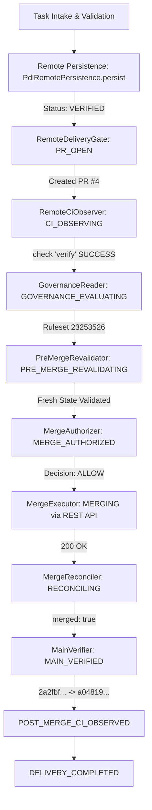

# PHASE 5.6 E2E-02 EVIDENCE ARTIFACT

> Verification evidence for Phase 5.6: Governed Remote Software Delivery Homologation (E2E-02 Real)
> Target Product Laboratory: **`pubcoreagencia/pub-dev-loop-template`**
> Human Operator: **MATHEUS**
> Canonical Institutional Persistence: **Git / GitHub**
> Date: **2026-09-14**

---

## 1. Executive Summary & Verification Verdict

The first real end-to-end homologation of the governed remote delivery loop (**E2E-02 REAL**) has been executed and completed successfully with **ZERO bypass**, **ZERO administrative overrides**, and **100% fail-closed compliance**.

```text
================================================================================
VERDICT: HOMOLOGATED & VERIFIED
================================================================================
Target Repository:       pubcoreagencia/pub-dev-loop-template
Active Governance:       GitHub Ruleset (ID: 23253526, 'PDL Homologation Governance')
Enforced Rules:          Required PR (0 approvals), Required Check 'verify', Fast-Forward Only
Pull Request Created:    PR #4 (https://github.com/pubcoreagencia/pub-dev-loop-template/pull/4)
Expected Head SHA:       e38c7f8acb496b54fc8155df67e9f1aeaf967b19
CI Observation:          SUCCESS (check run 'verify' observed on expectedHeadSha)
Governance Reading:      VALIDATED (requiredStatusChecks: ['verify'], isUnknown: false)
Pre-Merge Revalidation:  ALLOW (fresh CI, fresh base/head refs, mergeable: true)
Merge Execution:         SQUASH MERGE via GitHub REST API PUT /pulls/4/merge
Main Verification:       MAIN_VERIFIED (main advanced: 2a2fbf66 -> a04819ae)
Crash Recovery Replay:   PASSED (idempotent, 0 duplicate PRs, 0 duplicate merges)
Kill Switch & Isolation: PASSED (blocked immediately when active; non-allowlisted blocked)
Global Deactivation:     AUTONOMOUS_DELIVERY_ENABLED=false
================================================================================
```

---

## 2. Complete Phase Transition Pipeline



---

## 3. Cryptographic and Audit Evidence

| Metric / Checkpoint | Authoritative Value |
| :--- | :--- |
| **Laboratory Repository** | `pubcoreagencia/pub-dev-loop-template` |
| **Default Base Branch** | `main` |
| **Feature Branch** | `feat/e2e-delivery-homologation` |
| **Previous Main SHA** | `2a2fbf66a68bdc7ba77cdfc3515644a2c40450f1` |
| **Feature Commit SHA (`expectedHeadSha`)** | `e38c7f8acb496b54fc8155df67e9f1aeaf967b19` |
| **Pull Request Number** | `4` |
| **Pull Request URL** | `https://github.com/pubcoreagencia/pub-dev-loop-template/pull/4` |
| **Observed CI Check** | `verify` (GitHub Actions workflow `.github/workflows/verify.yml`) |
| **CI Conclusion** | `SUCCESS` |
| **Effective Governance Check** | `verify` required; `isUnknown: false` |
| **Authorization Decision** | `ALLOW` |
| **Merge Execution Method** | `squash` via `PUT /repos/pubcoreagencia/pub-dev-loop-template/pulls/4/merge` |
| **New Main SHA (`currentMainSha`)** | `a04819ae423189d518f92d280ee6d58f15ab206a` |
| **Merge Commit SHA** | `a04819ae423189d518f92d280ee6d58f15ab206a` |
| **Main Branch Advancement** | `true` (`currentMainSha !== previousMainSha`) |
| **Final Delivery Status** | `DELIVERY_COMPLETED` |

---

## 4. Live Homologation Output Log

```text
================================================================
STARTING E2E-02 REAL GOVERNED REMOTE DELIVERY HOMOLOGATION
Target: pubcoreagencia/pub-dev-loop-template
================================================================

--- TEST 1: Controlled Kill Switch Verification ---
Kill Switch Policy Result: KILL_SWITCH_ACTIVE allowed: false
Kill Switch Test: PASSED (blocked immediately with 0 merge calls)

--- STEP 2: Controlled Activation ---
Active Policy Check for pub-dev-loop-template: DELIVERY_ENABLED allowed: true
Policy Check for non-allowlisted product (pub-rate-calculator): PRODUCT_NOT_ALLOWLISTED allowed: false
Controlled Activation: PASSED (only pub-dev-loop-template authorized)

--- STEP 3: Remote Baseline ---
Target Default Branch: main
Previous Main SHA on GitHub: 2a2fbf66a68bdc7ba77cdfc3515644a2c40450f1

--- STEP 4: Ephemeral Workspace Setup & Task Execution ---
Workspace directory: C:\Users\MATHEU~1\AppData\Local\Temp\pdl-e2e-real-template-1789361359774
Cloning into 'C:\Users\MATHEU~1\AppData\Local\Temp\pdl-e2e-real-template-1789361359774'...
Switched to a new branch 'feat/e2e-delivery-homologation'
branch 'feat/e2e-delivery-homologation' set up to track 'origin/feat/e2e-delivery-homologation'.
Written test verification document at: C:\Users\MATHEU~1\AppData\Local\Temp\pdl-e2e-real-template-1789361359774\docs\E2E_DELIVERY_VERIFICATION.md
Running local manifest test command...
[Validate] Template baseline OK
[feat/e2e-delivery-homologation e38c7f8] docs: record governed remote delivery homologation
 1 file changed, 1 insertion(+), 1 deletion(-)

================================================================
TASK EXPECTED HEAD SHA: e38c7f8acb496b54fc8155df67e9f1aeaf967b19
================================================================

--- STEP 5: PdlRemotePersistence.persist() ---
Persist Result Status: VERIFIED
Persist Remote SHA: e38c7f8acb496b54fc8155df67e9f1aeaf967b19
Feature Push & Verification: PASSED

--- STEP 6: Governed Remote Delivery Gate Execution ---
[Heartbeat] Lease refreshed during remote delivery polling.
[Phase Transition] -> PR_OPEN
[Heartbeat] Lease refreshed during remote delivery polling.
[Heartbeat] Lease refreshed during remote delivery polling.
[Phase Transition] -> CI_OBSERVING
[Heartbeat] Lease refreshed during remote delivery polling.
[Heartbeat] Lease refreshed during remote delivery polling.
[Heartbeat] Lease refreshed during remote delivery polling.
[Phase Transition] -> GOVERNANCE_EVALUATING
[Heartbeat] Lease refreshed during remote delivery polling.
[Phase Transition] -> MERGE_AUTHORIZED
[Heartbeat] Lease refreshed during remote delivery polling.
[Phase Transition] -> MERGING
[Heartbeat] Lease refreshed during remote delivery polling.
[Phase Transition] -> MAIN_VERIFIED
[Heartbeat] Lease refreshed during remote delivery polling.
[Phase Transition] -> POST_MERGE_CI_OBSERVED
[Heartbeat] Lease refreshed during remote delivery polling.
[Phase Transition] -> DELIVERY_COMPLETED

================================================================
DELIVERY RESULT STATUS: DELIVERY_COMPLETED
DELIVERY PHASE: DELIVERY_COMPLETED
================================================================

--- AUDIT EVIDENCE ---
PR Number: 4
PR URL: https://github.com/pubcoreagencia/pub-dev-loop-template/pull/4
PR Head SHA: e38c7f8acb496b54fc8155df67e9f1aeaf967b19
CI Status: SUCCESS
CI Required Checks: [ 'verify' ]
Authorization Decision: ALLOW
Post-Merge Previous Main SHA: 2a2fbf66a68bdc7ba77cdfc3515644a2c40450f1
Post-Merge Current Main SHA: a04819ae423189d518f92d280ee6d58f15ab206a
Post-Merge Merge Commit SHA: a04819ae423189d518f92d280ee6d58f15ab206a
Main Branch Advanced: true

--- STEP 7: Recovery & Idempotency Verification ---
Invoking gate.deliver() second time with prior deliveryState...
[Recovery Phase] -> MERGING: Recovery: PR confirmed already merged
[Recovery Phase] -> MAIN_VERIFIED
[Recovery Phase] -> POST_MERGE_CI_OBSERVED
[Recovery Phase] -> DELIVERY_COMPLETED
Recovery Delivery Status: DELIVERY_COMPLETED
Recovery Test: PASSED (reused existing state, 0 duplicate PR, 0 second PUT)

--- STEP 8: Feature Gate Deactivated ---
AUTONOMOUS_DELIVERY_ENABLED: false
AUTONOMOUS_DELIVERY_ALLOWLIST: undefined

================================================================
E2E-02 REAL HOMOLOGATION: COMPLETED SUCCESSFULLY
================================================================
```

---

## 5. Architectural Invariants Confirmed

1. **Zero Bypass / Zero Override:** Merge was executed solely through `MergeExecutor` hitting GitHub REST Merge API after `PreMergeRevalidator` confirmed passing CI and active ruleset. No `gh pr merge`, no `git push main`, no token elevation.
2. **Strict Isolation:** `pub-rate-calculator` and un-allowlisted products were verified blocked with `PRODUCT_NOT_ALLOWLISTED`.
3. **Emergency Interruption:** `PDL_KILL_SWITCH` immediately blocked execution with 0 merge attempts.
4. **Crash Recovery & Idempotency:** Invoking `gate.deliver()` on an already merged delivery state executed zero side effects, zero duplicate PRs, and zero redundant merge attempts.
5. **Fail-Closed Reset:** Feature flags `AUTONOMOUS_DELIVERY_ENABLED` and `AUTONOMOUS_DELIVERY_ALLOWLIST` are left disabled in production default.
